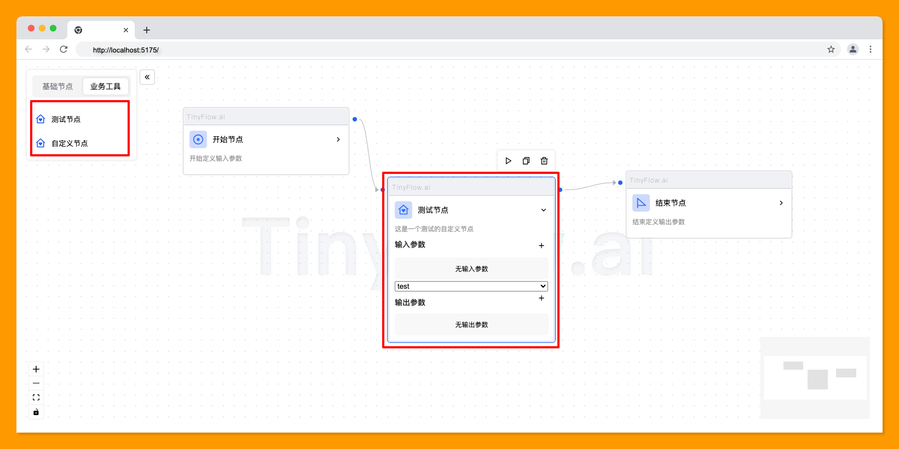
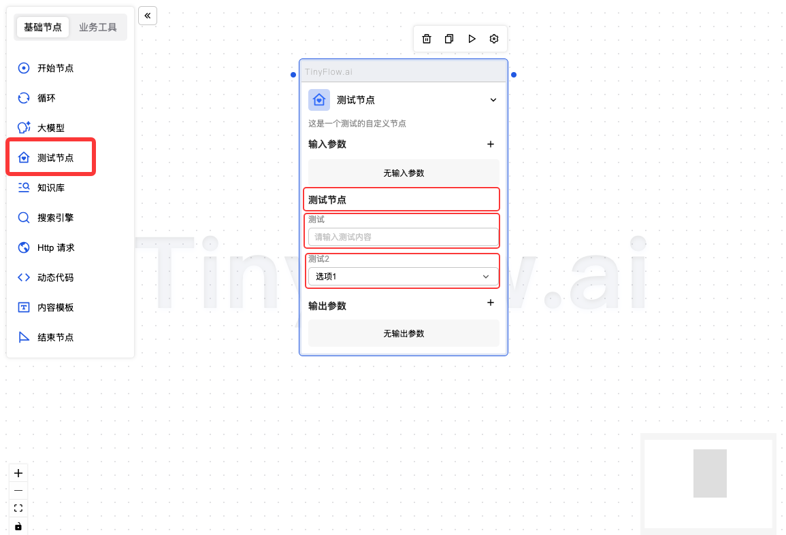

# 节点（Node）

在执行链（Chain）中，节点（Node）是负责在执行链中进行执行的，并得到执行结果的对象。执行链的最终执行结果，是由节点（Node）的返回值决定的。


## 节点类型

在 Tinyflow 中，内置了 7 种节点类型，分别如下：

- 开始节点
- 结束节点
- 大模型节点
- 知识库节点
- 搜索引擎节点
- Http 请求节点
- 动态代码节点
- 内容模板节点

以下是为章节内容填充的详细说明，涵盖每个节点类型的定义、功能和用途，并补充了自定义节点的相关内容。

## 开始节点

开始节点是执行链的起点，用于初始化整个执行链的运行，定义执行链的输入参数，它是每个执行链中必须包含的节点类型。

**特点**:

- 每个执行链只能有一个开始节点。
- 开始节点没有输入边，但可以有多个输出边。

## 结束节点

结束节点是执行链的终点，用于终止整个执行链的运行，并返回最终结果。

**特点**:

- 每个执行链可以有多个结束节点。
- 结束节点没有输出边，但可以有多个输入边。

## 大模型节点

大模型节点用于调用大型语言模型（LLM）或其他复杂模型，完成特定任务，如文本生成、问答、翻译等。

**功能**:

- 接收输入数据并调用预训练模型。
- 返回模型的推理结果。
- 支持多种模型配置和参数调整。

## 知识库节点

知识库节点用于从预定义的知识库中检索相关信息，支持基于文本、结构化数据或向量数据库的查询。

**功能**:

- 根据输入问题或关键词检索相关知识。
- 支持多种查询方式，如全文搜索、语义匹配等。
- 返回与问题相关的上下文信息。

**特点**:

- 需要连接到外部知识库或数据库。
- 适用于问答系统、智能客服等场景。

## 搜索引擎节点

搜索引擎节点用于调用外部搜索引擎（如 Google、Bing）获取实时信息。

**功能**:

- 根据输入关键词执行搜索。
- 返回搜索结果的摘要或链接。
- 支持过滤和排序功能。

**特点**:

- 需要配置搜索引擎的 API 密钥。
- 适用于需要实时信息的场景。

## Http 请求节点

Http 请求节点用于发送 HTTP 请求到外部服务，并处理响应数据。

**功能**:

- 支持 GET、POST、PUT、DELETE 等 HTTP 方法。
- 可以设置请求头、请求体和参数。
- 返回 HTTP 响应的状态码、数据和错误信息。

## 动态代码节点

动态代码节点允许用户编写自定义代码逻辑，并将其嵌入到执行链中。

**功能**:

- 支持多种编程语言（如 Groovy、QLExpress）。
- 在运行时动态执行代码。
- 返回代码执行的结果。

### 内容模板节点

内容模板节点用于根据预定义的模板生成格式化内容，如邮件、报告等。

**功能**:

- 使用模板引擎（如 Enjoy、Freemarker）进行渲染。
- 支持变量替换和条件逻辑。
- 返回生成的文本内容。

## 自定义节点

自定义节点允许开发者根据特定需求创建新的节点类型，扩展 Tinyflow 的功能。



以下是一个简单的自定义节点示例：

```ts
const customNodes = {
    'custom-node': {
        title: '自定义节点',
        description: '这是一个测试的自定义节点',
        icon: '<svg xmlns="http://www.w3.org/2000/svg" viewBox="0 0 24 24" fill="currentColor"><path d="M20 20C20 20.5523 19.5523 21 19 21H5C4.44772 21 4 20.5523 4 20V11H1L11.3273 1.6115C11.7087 1.26475 12.2913 1.26475 12.6727 1.6115L23 11H20V20ZM18 19V9.15745L12 3.7029L6 9.15745V19H18ZM12 17L8.64124 13.6412C7.76256 12.7625 7.76256 11.3379 8.64124 10.4592C9.51992 9.58056 10.9445 9.58056 11.8232 10.4592L12 10.636L12.1768 10.4592C13.0555 9.58056 14.4801 9.58056 15.3588 10.4592C16.2374 11.3379 16.2374 12.7625 15.3588 13.6412L12 17Z"></path></svg>',
        sortNo: 2,
        render: (parent, node, flowInstance) => {
            parent.innerHTML = `<select style="width: 100%">
                <option>test</option>
                <option>test1</option>
                <option>test2</option>
                </select>`;

            parent.querySelector('select')
                ?.addEventListener('change', (e) => {
                    console.log('select change: ', e);
                    flowInstance.updateNodeData(node.id, {
                        test: e.target.value
                    });
                })
            ;

            console.log('render: ', node, flowInstance);
        },
        onUpdate: (parent, node) => {
            console.log('onUpdate: ', node);
        }

    },
};
```

在组建中，通过 `customNodes` 属性传入自定义节点。

```html
<Tinyflow data={JSON.parse(data)} customNodes={customNodes} />
```

**customNodes** 配置说明：

- **title**: 节点标题，用于在节点列表中显示。
- **description**: 节点描述，用于在节点列表中显示。
- **icon**: 节点图标，用于在节点列表中显示。
- **sortNo**: 节点排序号，用于定义在左侧业务节点中的顺序。
- **group**: 可配置为 `base` 或者 `tools`，表示该节点属于基础节点还是工具节点。
- **rootClass**: 根节点容器的样式类名。
- **rootStyle**: 根节点容器的样式。
- **render**: 节点渲染函数。
- **onUpdate**: 监听节点数据更新。
- **forms**: 表单配置，用于在节点编辑器中显示和编辑节点的属性。

**render** 函数参数说明：

- **parent**: 节点容器元素。
- **node**: 当前节点对象。
- **flowInstance**: 当前流程实例对象，可以用于获取（或更新等操作）当前流程实例的状态和数据等。

**onUpdate** 函数参数说明：

- **parent**:  节点容器元素。
- **node**: 当前节点对象。

> 注意：不要再 onUpdate 中去更新节点数据，否则会导致循环更新（死循环）。

**forms 配置示例**

```js
 {
    title: '测试节点',
    description: '这是一个测试的自定义节点',
    icon: '<svg xmlns="http://www.w3.org/2000/svg" viewBox="0 0 24 24" fill="currentColor"><path d="M20 20C20 20.5523 19.5523 21 19 21H5C4.44772 21 4 20.5523 4 20V11H1L11.3273 1.6115C11.7087 1.26475 12.2913 1.26475 12.6727 1.6115L23 11H20V20ZM18 19V9.15745L12 3.7029L6 9.15745V19H18ZM12 17L8.64124 13.6412C7.76256 12.7625 7.76256 11.3379 8.64124 10.4592C9.51992 9.58056 10.9445 9.58056 11.8232 10.4592L12 10.636L12.1768 10.4592C13.0555 9.58056 14.4801 9.58056 15.3588 10.4592C16.2374 11.3379 16.2374 12.7625 15.3588 13.6412L12 17Z"></path></svg>',
    sortNo: 310,
    group: 'base',
    forms: [
        {
            type: 'heading',
            label: '测试节点'
        },
        {
            type: 'input',
            name: 'test',
            label: '测试',
            placeholder: '请输入测试内容'
        },
        {
            type: 'select',
            name: 'test2',
            label: '测试2',
            placeholder: '请选择测试内容',
            defaultValue: '1',
            options: [
                {
                    label: '选项1',
                    value: '1'
                },
                {
                    label: '选项2',
                    value: '2'
                },
                {
                    label: '选项3',
                    value: '3'
                }
            ]
        }
    ];
}
```

以上配置显示如下：



- “forms”：用于配置节点的表单项
- “group”：用户配置节点在左边工具栏的显示位置，可选值为 “base” 或者 “tools”
- “sortNo”：用于定义节点在左侧工具栏中的顺序，默认情况下，“开始节点” 的 sortNo 为 100，之后每个节点增加 100，最后结束节点为 900
