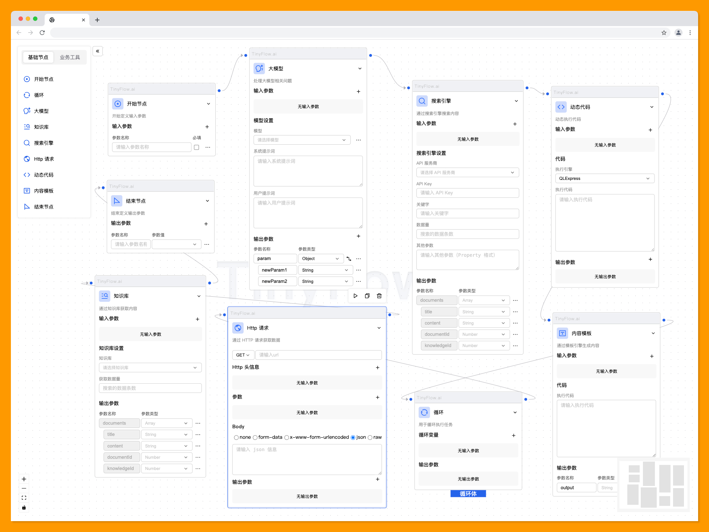

# Tinyflow 是什么？

Tinyflow 是一个轻量级、灵活且无侵入性的 **AI 工作流编排** 解决方案，旨在帮助开发者将 AI 工作流无缝集成到现有的业务系统中，使其快速升级为 AI 驱动的下一代人工智能应用。

## 一、核心理念

Tinyflow 的设计理念是“简单、灵活、无侵入性”。

它不是要取代现有的业务系统，而是要成为这些系统的“智能大脑”，让 AI 与业务紧密结合，发挥最大价值。

## 二、技术特点

1. **极轻量级**

Tinyflow 专注于核心问题，代码库轻量，学习成本低，但功能强大，无论是简单的任务编排还是复杂的多模态推理都能轻松应对。

2. **高度自由**

Tinyflow 不会强迫你改变现有的技术栈，无论是前端开发者、后端工程师还是数据科学家，都可以在自己的领域找到切入点。

3. **面向未来**
 
Tinyflow 的架构是模块化的，支持插件机制，可以随着业务需求不断扩展，随时添加新功能。

4. **开发者友好**

API 设计直观易懂，文档清晰，提供丰富示例代码，即使是新手也能快速上手。

## 三、技术实现

- **前端集成**

基于 Web Component 开发，支持所有前端框架（如 Vue、React 等），不依赖任何 UI 样式框架，避免与现有 UI 冲突。

- **后端支持**

支持 Java（JDK8 起步）、Node.js 和 Python 等多种编程语言，方便不同语言的后端集成。

## 四、使用场景

假设你是一家电商公司的技术负责人，有一个老掉牙的订单管理系统（OMS），每天手动处理大量退货申请。

传统做法需要把数据导出到 AI 平台，再导回 OMS，过程复杂且有数据泄露风险。

而使用 Tinyflow，只需在 OMS 中集成它，定义一个工作流：当用户提交退货申请时，AI 自动分析原因并判断是否批准，若需人工介入，还可自动生成工单通知相关人员，
一切都在 OMS 内部完成，不存在数据泄露风险。

## 五、未来规划

目前 Tinyflow 已发布多个版本，未来计划：

1. 增加更多内置组件，支持更多 AI 模型和企业服务节点。
2. 提升后端执行感知能力，包括实时监控、性能统计、异常检测等。
3. 推出国际化支持，筹备英文版文档和社区。
4. 鼓励开发者贡献插件，共同打造繁荣生态。

## 六、Git 仓库

Tinyflow 是一个“小而美”的项目，它承载了对 AI 技术未来的思考。如果你对 Tinyflow 感兴趣，可以访问 Gitee 或 GitHub 仓库，或加入社区讨论。

- **Gitee**：https://gitee.com/tinyflow-ai/tinyflow
- **GitHub**：https://github.com/tinyflow-ai/tinyflow
